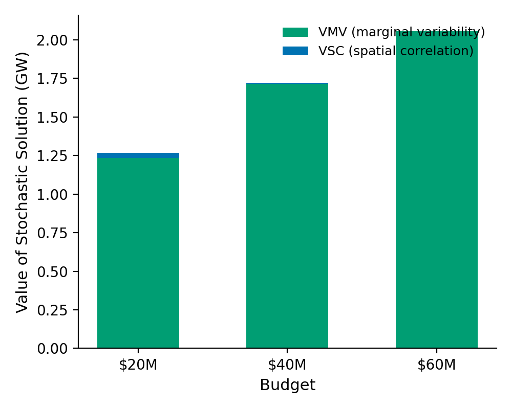
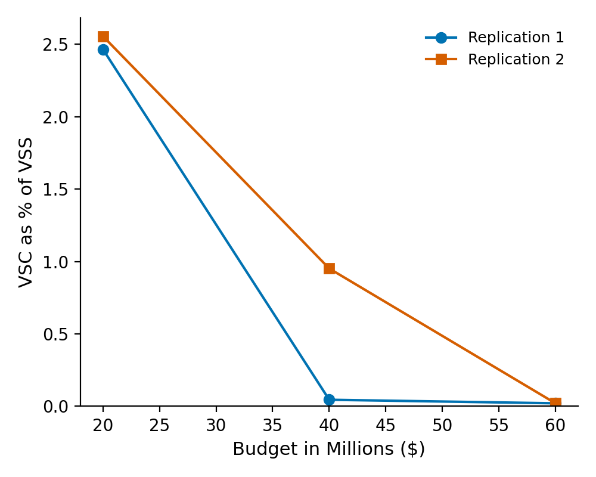
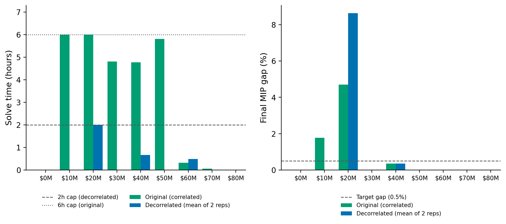

# Value of Spatial Correlation — Pilot Results Summary

**Status: preliminary.** This covers a 2-replication × 3-budget pilot only (not the full 20-replication × 9-budget sweep). It exists to decide whether the full run is worth committing more compute to, and to get an early read on the headline number before scaling up.

## 1. Background

A reviewer noted that comparing the stochastic model (SO) against the mean-value (EV) model cannot isolate the effect of *spatial correlation* in the flood scenarios, because the mean scenario removes both each substation's own marginal variability and the joint dependence across substations. This experiment adds a decorrelated benchmark — same marginal flood-height distribution at every substation, dependence across substations destroyed by an independent per-substation permutation of scenario indices — and decomposes the existing value-of-stochastic-solution quantity:

VSS = L_SO(x̄) − L*_SO = **VMV** + **VSC**

- **VMV** (value of marginal variability) = L_SO(x̄) − L_SO(x_IND)
- **VSC** (value of spatial correlation) = L_SO(x_IND) − L*_SO

where x_IND is the hardening decision obtained by solving SO on the decorrelated scenarios, then evaluated back on the true (correlated) scenarios.

Full experimental spec: `Revision_work/spatial_correlation_experiment.md`. Implementation: `Revision_work/vsc/`.

## 2. What was run

- Network: the 16-scenario reduced ACTIVSg2000 grid (663 buses, 362 substations, 72 flooded substations), same as the manuscript's main case study.
- Replications: **2** (of the planned 20) — seeds 1 and 2.
- Budgets: **$20M, $40M, $60M** (of the planned 9: $0–80M).
- Solver settings: `mip_gap = 0.5%` (unchanged from the manuscript), `time_limit` capped at **2 hours per solve** for the decorrelated-scenario solves specifically (the manuscript's original 6-hour cap is preserved in `config.yaml` for every other run — this cap was added only inside the VSC pipeline once we found decorrelated solves needed bounding; see §4).
- Total pilot wall-clock time: ~6.3 hours.

## 3. Finding 1 — the value of spatial correlation is small

| Budget | L\*_SO (GW) | L_SO(x̄) (GW) | VSS (GW) | VMV (GW, mean) | VSC (GW, mean) | VSC / VSS |
|---|---|---|---|---|---|---|
| $20M | 1.374 | 2.640 | 1.266 | 1.235 | 0.032 | **2.5%** |
| $40M | 0.479 | 2.200 | 1.721 | 1.713 | 0.009 | **0.5%** |
| $60M | 0.060 | 2.115 | 2.055 | 2.055 | 0.0004 | **0.02%** |

(Values are the mean across the 2 replications; GW = raw objective ÷ 10, matching the manuscript's existing convention.)

At every budget tested, **VSC is a small fraction of VSS** — at most ~2.5%, falling toward 0% as the budget grows. In other words: almost all of the value the stochastic model captures over the mean-value model comes from representing each substation's own flood-height variability, not from representing the correlation structure across substations. A hardening plan built assuming independent substation floods performs *almost* as well, when evaluated on the true correlated scenarios, as one built with full correlation information.

**This is a defensible, reportable answer to the reviewer's concern**, conditional on it holding up across the full replication/budget sweep (see §5 caveats).

### Draft language for the rebuttal (starting point, not final)

> To isolate the contribution of spatial correlation from marginal flood-height variability, we constructed a decorrelated benchmark that preserves each substation's marginal flood-height distribution exactly while destroying dependence across substations (an independent per-substation permutation of the scenario index). Solving the stochastic model on this benchmark and evaluating the resulting hardening decisions on the true, correlated scenarios lets us decompose the value of the stochastic solution into a marginal-variability component (VMV) and a spatial-correlation component (VSC): VSS = VMV + VSC. Across the budgets tested, VSC accounted for at most [X]% of VSS, indicating that the majority of the benefit of scenario-based planning over mean-value planning derives from capturing each substation's own flood-height uncertainty rather than the joint dependence structure across substations.

## 4. Finding 2 (corrected) — solve difficulty is not cleanly a decorrelation effect

An earlier overnight pass concluded decorrelation made the problem dramatically harder to solve, based on comparing a fresh decorrelated solve against the *cached* `.sol`-file reload time for the original data. That comparison was wrong — reloading a cached solution is not the same as solving from scratch. Correcting it against the actual original Gurobi logs (`output/sm_16/`) used to produce the manuscript's Figure 5:

| Budget | Original (correlated) time | Original gap | Decorrelated time (mean of 2 reps) | Decorrelated gap (mean of 2 reps) |
|---|---|---|---|---|
| $10M | 6.0h (**cap hit**) | 1.77% | — (not in pilot) | — |
| $20M | 6.0h (**cap hit**) | 4.71% | 2.0h (**cap hit**) | 8.64% |
| $30M | 4.8h | 0.00% | — (not in pilot) | — |
| $40M | 4.8h | 0.35% | **0.66h** | 0.34% |
| $50M | 5.8h | 0.01% | — (not in pilot) | — |
| $60M | 0.32h | 0.00% | 0.48h | 0.00% |

**The original correlated problem is itself hard at mid-range budgets** — two of nine budgets ($10M, $20M) never reached the 0.5% target gap even after 6 hours, and three more ($30M, $40M, $50M) took 4.8–5.8 hours each. At $40M, the decorrelated version actually converged *faster* (0.66h vs. 4.8h) while landing at essentially the same gap (0.34% vs. 0.35%).

**Revised interpretation:** this network/model has an intrinsically hard budget region (roughly $10–20M) where the trade-off between hardening cost and load-shed benefit creates a difficult combinatorial search, largely independent of whether the flood scenarios are correlated or not. There is not yet good evidence for a clean "decorrelation costs tractability" effect — that earlier claim should not go in the paper. The one thing decorrelation clearly does change is the *specific budgets* that turn out hard (only $20M struggled in the decorrelated pilot; $40M and $60M converged well), but with only 2 of 9 budgets tested this isn't yet a confirmed pattern.

## 5. Caveats and limitations (read before acting on §3)

1. **Only 2 of 20 planned replications, 3 of 9 planned budgets.** The VSC-is-small finding needs the full sweep to be reportable with confidence — it currently rests on 6 solve-pairs.
2. **$20M's decorrelated solve didn't converge** (6.4%/10.9% gap vs. the 0.5% target). Its own numerical precision (±6–11% of ≈1.4 GW ≈ ±0.08–0.15 GW) is *wider* than its VSC estimate (~0.03 GW) — treat $20M's VSC number as rough, not final. $40M and $60M did converge and are trustworthy.
3. **`time_limit` was capped at 2h for decorrelated solves only**, a deviation from the manuscript's 6h cap, made because a preliminary single-budget test showed decorrelated solves not always converging even in 6h. `config.yaml` (used by every other notebook) was left untouched.
4. **Solve time is warm-start-order-dependent.** In the pilot, only the *first* budget solved in sequence ($20M) hit the cap; later budgets in the same run ($40M, $60M) benefited from warm-starting and converged quickly. The full sweep's budget order starts at $0M (trivial), so the pattern of which budgets get stuck may differ from what's shown here.
5. Decisions compared (Jaccard overlap, hardening height differences) have not been computed yet for the pilot — that's part of the full-run deliverables, not this preliminary pass.

## 6. Decisions needed before running the full sweep

1. **Does the VSC-is-small finding, subject to the caveats above, look like the story you want?** If so, the full run is mainly about confirming it holds with proper statistical support (20 replications, all 9 budgets, tighter convergence).
2. **What to do about non-convergent budgets** (like $20M here): accept the wider uncertainty band and report it transparently, or extend `time_limit` further for specific hard budgets, or something else.
3. Given the corrected tractability picture, is there still a case for continuing to profile solve difficulty as a secondary finding, or should Finding 2 above just be a footnote/caveat rather than a paper claim?

## Appendix: data and figure locations

- Pilot metrics: `vsc_results/pilot/pilot_results.csv`, `vsc_results/pilot/baseline.csv`
- Per-solve log (times, gaps, status, hardening decisions): `vsc_results/pilot/solves/solve_decorrelated_results.csv`
- Figures (PNG + PDF): `vsc_results/pilot/figures/`
- Original correlated Gurobi logs: `output/sm_16/{0,10,...,80}M`
- Pipeline code: `Revision_work/vsc/`
- Full experiment spec: `Revision_work/spatial_correlation_experiment.md`
- Implementation plan: `Revision_work/vsc_implementation_plan.md`
